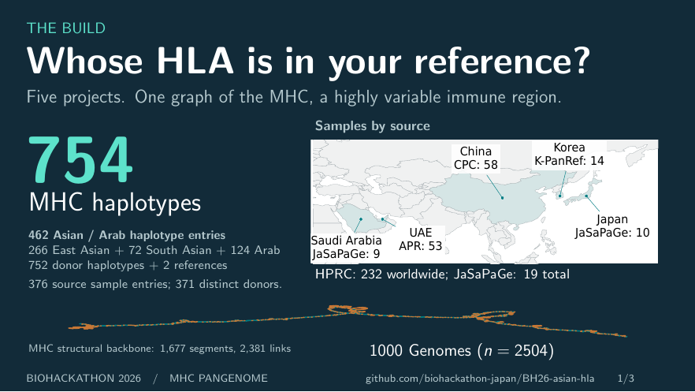
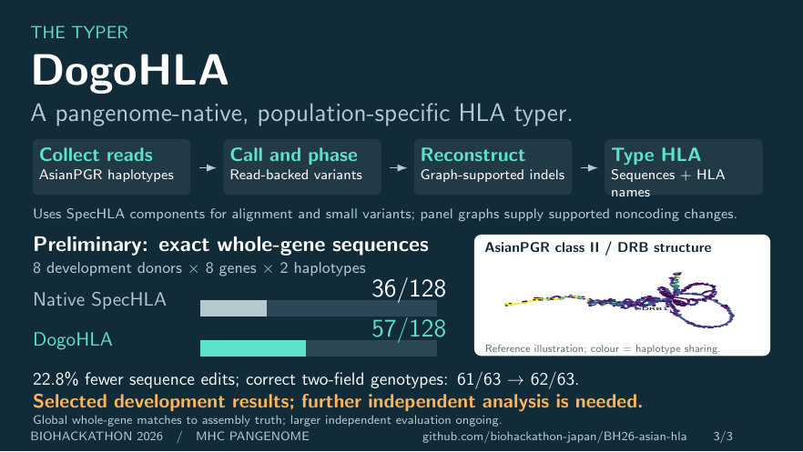

# BioHackathon wrap-up

Three slides: reference construction, variant recovery and the preliminary
DogoHLA method. DogoHLA is included in this presentation; the manuscript
currently focuses on the Asian HLA graph and variant/typing comparisons.

[Presentation](slides.pdf) · [Editable source](slides.tex) · [Speaker notes](speaker-notes.md)

Build the PDF and all three previews with TeX Live and Poppler:

```sh
make -C hackathon-wrapup
```

The deck is self-contained. Supporting plots and datasets are unnecessary for
building it. The `previous/` directory retains an earlier presentation;
`make_figures.py` generates historical supporting plots outside this deck.





## Evidence

1. **Construction counts:** `hla-typer/source/haplotype_donors.tsv` and
   `hla/results/tables/hprc_r2_populations.tsv`. Source sample counts are APR 53,
   HPRC 232, JaSaPaGe 19, K-PanRef 14 and CPC 58. They contribute 752 donor
   haplotype entries; GRCh38 and CHM13 bring the total to 754. Five duplicated
   donor identities across projects give 371 distinct donors. East Asian
   entries total 266, South Asian 72, and Arab 124: 462 combined. Counts are
   haplotype entries and preserve construction duplicates. The prior 390
   figure covered East Asian and Arab strata but omitted South Asian HPRC.
2. **Variant counts:** `hla-asian50/refined/results/variant_per_donor.tsv`,
   repaired full panel, all-truth universe. All 40 donors have 79,844 eligible
   SNV sites and 298 SV-containing graph sites. These are site counts per
   donor. An SV-bearing truth genotype is a separate subset defined by that
   donor's alleles. Its pooled denominators are 1,465 EAS and 1,577 SAS.
   The fixed three-way shared-SNV comparison has 1,007,636 donor-site
   comparisons in each ancestry stratum.
3. **Variant recovery:** `hla-asian50/refined/results/variant_summary.tsv` and
   `variant_paired.tsv`, all-truth universe, truth-SV-length class, all endpoint.
   EAS: HPRC 1,060/1,465; full 1,117/1,465. SAS: HPRC 1,188/1,577; full
   1,219/1,577. Paired gains are 3.89 points (95% donor bootstrap interval
   2.40–5.29) and 1.97 (0.32–3.47). Reads and caller are held fixed. Panel size
   and population composition change together; test assemblies contribute to
   the shared graph topology. The two closely spaced SAS rate labels use
   outward horizontal offsets for legibility.
4. **DogoHLA development:** `hla-spechla-pg/RESULTS-2026-09-18.md`,
   `results/native-rescore-20260918/comparison.json` and
   `results/experiments/20260918-hybrid-v4/paired-score/summary.tsv`.
   Same eight donors, global whole-gene metric: native 36/128 exact sequences,
   selected candidate 57/128; total edits 97,965 to 75,634 (22.8% reduction);
   two-field genotypes 61/63 to 62/63. These replace the earlier infix metric
   and earlier candidate. They are selected development results requiring
   further independent evaluation. No live validation scores are included.

## Follow-up after the ongoing analysis

Add non-Asian donor counts, eligible SNV/SV counts and paired results only after
the analysis completes and its outputs and truth denominators are verified.
This deck deliberately retains the completed 40-donor Asian comparison.

## Vector artwork

The deck embeds vector PDF panels from manuscript Figure 1: the Asian cohort
map, MHC structural backbone and class II/DRB bundle graph. Matching SVGs
are in `figures/paper-panels/`. These remain sharp when enlarged; the PNG
slide previews are for browsing. Regenerate the panels with
`scripts/plot_graph_figure.py` in the manuscript repository and copy the
contents of `paper/figures/slide_panels/` here.
