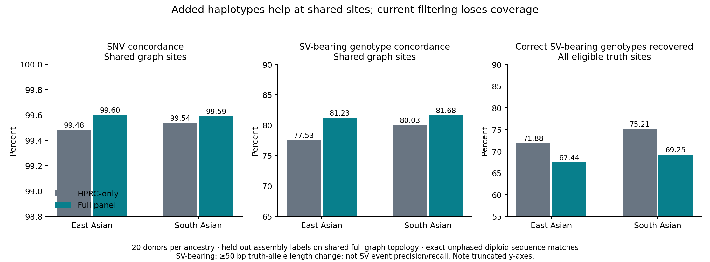

# Does the Asian-enriched panel help?

**It improves exact genotype concordance on shared sites, especially SV-bearing genotypes, but the present full-panel pipeline recovers fewer correct genotypes overall because it discards more sites.** These are held-out assembly-concordance results, not independent clinical accuracy.

## Full panel versus HPRC-only

Forty fixed donors: 20 East Asian (EAS), 20 South Asian (SAS). Both arms use PanGenie 4.2.1 on identical recruited reads, with five-fold test-family exclusion from the haplotype panels. The full panel has approximately 363 training donors; HPRC-only has 224–225. Thus panel size and ancestry composition are confounded.

| Stratum | Endpoint on shared sites | Full panel | HPRC-only | Difference, percentage points (95% paired donor bootstrap CI) |
|---|---|---:|---:|---:|
| EAS | SNV genotype | 99.60% (1149823/1154432) | 99.48% (1148478/1154432) | +0.12 (+0.06, +0.18) |
| EAS | SV-bearing genotype | 81.23% (987/1215) | 77.53% (942/1215) | +3.70 (+1.70, +5.65) |
| SAS | SNV genotype | 99.59% (1149724/1154432) | 99.54% (1149117/1154432) | +0.05 (-0.02, +0.13) |
| SAS | SV-bearing genotype | 81.68% (1092/1337) | 80.03% (1070/1337) | +1.65 (+0.31, +2.91) |

SNVs are single-base alleles at top-level graph sites. The SV-bearing endpoint requires at least one assembly-truth allele whose length differs from the reference by at least 50 bp. It measures exact diploid allele-sequence recovery of the whole bubble, including embedded small variants. It is **not** standard SV event precision/recall, a test of balanced rearrangements, C4 copy-number accuracy, or long-range phase.

The SV improvements correspond to 45 additional correct EAS genotypes and 22 additional correct SAS genotypes. Fifteen of 20 EAS donors and 13 of 20 SAS donors improve on this endpoint. The SAS SNV confidence interval includes zero. Bootstrap intervals use 10,000 paired donor resamples within ancestry and are conditional on the fixed sites and training folds; they do not account for overlapping training sets, assembly errors or multiplicity.

## Coverage changes the overall conclusion

The conservative panel builder drops any site with a missing or unphased training genotype. In fold 0 it drops 19,211 sites for this reason in the full panel versus 266 in HPRC-only. HPRC-only also omits many monomorphic training sites, but its net retained-site coverage remains higher. Missing records are not converted to reference calls.

The following endpoint is **correct-genotype recovery across all eligible assembly-truth sites**, counting absent records and no-calls as failures. It combines coverage and concordance, and must not be confused with conditional accuracy:

| Stratum | Endpoint | Full panel | HPRC-only |
|---|---|---:|---:|
| EAS | All eligible SNV genotypes | 81.40% (1299819/1596880) | 87.16% (1391805/1596880) |
| EAS | All eligible SV-bearing genotypes | 67.44% (988/1465) | 71.88% (1053/1465) |
| SAS | All eligible SNV genotypes | 81.39% (1299760/1596880) | 87.18% (1392152/1596880) |
| SAS | All eligible SV-bearing genotypes | 69.25% (1092/1577) | 75.21% (1186/1577) |

Therefore the current full-panel output is **not a better replacement for HPRC-only output**. Added haplotypes help where both panels are usable, but the present construction/filtering policy loses too much coverage. This is an implementation limitation, not evidence that added diversity intrinsically reduces accuracy.

## Linear-reference comparison

The comparator is the published NYGC 3,202-sample high-coverage GRCh38 BWA-MEM/GATK 3.5 joint callset, using the October 2020 filtered SHAPEIT2-duohmm phased release and PASS sites. This is a strong available **published baseline**, not a new matched single-sample caller run. Its full-WGS recruitment, cohort joint calling, pedigree-assisted phasing, priors and filtering differ from PanGenie. The release excludes singletons and applies missingness, Hardy–Weinberg and Mendelian-error filters. It is a prediction arm, never the truth. [Calling methods](source/NYGC_README.pdf), [phasing/filtering methods](source/NYGC_PHASING_README.pdf); [study](https://pmc.ncbi.nlm.nih.gov/articles/PMC9439720/).

Only pure SNV records present in both graph outputs and the linear PASS callset are compared below. Allele sequences and GRCh38 reference bases must match; duplicated linear positions and complex/mixed records are excluded. No-call genotypes remain in the denominator. The graph reference sequence was verified over all 5,169,788 bases against the corresponding GRCh38 interval.

| Stratum | Full panel | HPRC-only | Linear NYGC | Genotypes per arm |
|---|---:|---:|---:|---:|
| EAS | 99.83% | 99.78% | 99.69% | 1007636 |
| SAS | 99.83% | 99.80% | 99.64% | 1007636 |

On this shared SNV subset, full-panel concordance exceeds the published linear baseline by **0.136 percentage points in EAS** (paired donor 95% CI 0.076–0.195) and **0.185 points in SAS** (0.130–0.241). Sixteen of 20 EAS donors and 19 of 20 SAS donors improve. This supports better recovery of graph-consistent assembly genotypes at these sites, not a universal or independent-truth accuracy claim.

The raw unphased release was initially requested but retrieval was stopped for runtime reasons before any linear accuracy results were inspected; its partial file is never scored. The smaller phased release is not the final combined SNV/INDEL/SV release. This shared-PASS-site comparison favors sites available to all three pipelines; it does not measure genome-wide sensitivity or linear-only false positives. The separate `graph_shared_SNV` rows in the saved metrics retain missing linear records as failures without assuming homozygous reference. There is no harmonized linear SV comparison in this analysis, so superiority over linear SV calling remains **unestablished**.

## Classical HLA: separate endpoint

Only eight EAS donors have independent historical experimental HLA labels. Thirty-nine diploid gene genotypes are eligible at numeric two-field resolution across A, B, C, DRB1 and DQB1 (one DQB1 label is unresolved). T1K matches 34/39 genotypes (72/78 alleles); SpecHLA matches 36/39 (74/78 alleles). These small, database-mismatched results do not establish a general ranking. Historical assay resolution and allele-name changes can explain some disagreements; individual discordances are retained for review. No SAS experimental HLA accuracy is available.

T1K calls with quality ≤0 are excluded, comma-separated ambiguity must collapse to one numeric two-field allele, and a single reported allele is interpreted as homozygosity at these five classical loci; this is not a copy-number inference. SpecHLA uses its native IPD-IMGT/HLA 3.38.0 database. [T1K output specification](https://github.com/mourisl/T1K#inputoutput). Expression suffixes are outside this numeric endpoint. These specialist results cannot rank graph panels because the PanGenie outputs have not been translated into classical HLA genotypes.

## What the graph comparison actually tests

- HPRC-only is a haplotype-panel ablation on the **same full graph topology**, not an independently constructed official HPRC release-2 graph.
- Test donors and known family/alias paths were excluded from their training panels, but their assemblies participated in global graph construction. The evaluation is transductive.
- Truth is the held-out donor genotype in the full-graph deconstruction, not an independent GIAB-style truth set. Missing/conflicting/non-ACGT truth is excluded. No independent assembly-confidence or mappability mask was available; reference-aligned recruitment bounds are not a high-confidence mask.
- Analysis is restricted to chr6:28,510,121–33,480,577 (1-based, inclusive), inside the primary read-recruitment interval. All relevant allele-reference spans must fit. Reads were recruited using reference alignments, so unrestricted graph read-rescue benefits are not tested.
- Whole bubble allele sequences, not numeric allele indices or VCF IDs, determine unphased diploid concordance. This prevents ALT-order and duplicate-sequence mismatches. The shared-site universe is selected without looking at prediction correctness.
- These results support adding useful reference haplotypes, but do not isolate an ancestry-matching effect from a larger panel-size effect. A size-matched composition control is required for that claim.

## Next experiment justified by these results

Preserve the HPRC-callable sites while adding Asian haplotypes: use a validated missing-aware panel preparation strategy or local complete haplotype panels, keeping missing genotypes distinct from reference. Compare the corrected pipeline on the frozen union and shared-site denominators, include a size-matched panel control, and use new held-out donors or independently built training graphs for confirmation. Do not tune filters against the observed truth labels. A sequence-harmonized linear SV baseline and independent callable truth are needed before claiming improved SV calling over a linear reference.

## Reproduction and artifacts

On DDBJ, run `score_panels.py --run /home/leechuck/hla/codex-asian50/run --out RESULTS`, then `score_linear.py` with the same arguments after `fetch_linear.sbatch`. Heavy work uses the supplied Slurm jobs. Locally run `score_hla.py`, `summarize.py`, `make_report.py` and `plot_results.py`. `python3 -m unittest discover -s hla-asian50/accuracy -p "test_*.py"` checks sequence matching, phase invariance, missing-call handling and VCF FORMAT parsing.

- [Per-donor graph metrics](results/panel_per_donor.tsv), [aggregate metrics](results/summary.tsv), [paired bootstrap](results/paired_bootstrap.tsv).
- [SV sites where the panels differ in correctness](results/sv_differential.tsv), [experimental HLA comparisons](results/hla_experimental.tsv).
- [Reference interval](results/reference_interval.tsv), [input hashes](source/evaluation_inputs.sha256), [full reference sequence verification](source/reference_validation.json).
- Native prediction hashes remain in [the calling-run manifest](../run/source/pangenie_output_manifest.json). Large VCFs stay on DDBJ; scripts, compact results and provenance are versioned here.
