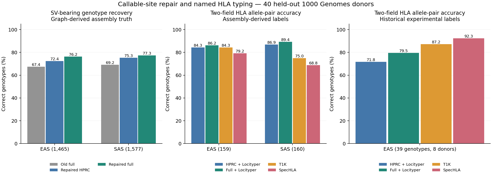

# Callable-site repair, Asian-panel augmentation, and named HLA typing

Completed 2026-09-17: all 40 variant reruns, 40 paired named-HLA runs, scoring, and native-output archives.

The callable-site repair reverses the previous coverage penalty: on the same
40 held-out donors, the full panel now outperforms the repaired HPRC-only panel
for recovery of SV-bearing genotypes. This is graph-derived assembly concordance,
not an independent SV validation or a claim of improved C4 copy-number typing.

## What changed

The original complete-case panel builder discarded a whole graph bubble if any
training genotype was missing. PanGenie 4.2.1 already supports phased missing
alleles. The repaired builder retains known alleles and leaves unknown alleles
missing. It never fills unknown alleles with reference. Both HPRC-only and full
panels use the same repaired rule, frozen training membership, and test-family
exclusions. Only training-observed alternate alleles enter each panel.

Across five folds, full-panel sites increase from approximately 81,000 to
100,268–100,385, restoring 19,043–19,072 sites per fold. HPRC-only panels restore
221–227 sites. Every old site survives; every repaired HPRC site is also in the
full panel. These assertions pass on both panel inputs and output VCFs. This
changes the graph's genotyping representation, not its GBZ topology.

All 40 donors (20 EAS, 20 SAS) were rerun with the same MHC-recruited reads and
PanGenie settings. The independent SHA256 allele-sequence scorer reproduces every
old all-truth metric exactly; numerical VCF allele indices are never compared
across panels. Missing sites and no-calls remain failures.

## SV-bearing genotypes: coverage and exact recovery

A truth-SV genotype contains an allele whose length differs from reference by
at least 50 bp. A success requires the complete unordered diploid allele-sequence
pair to match the held-out assembly at that top-level graph bubble. This is
stricter than detecting an SV event and does not measure event-level precision,
recall, or breakpoint tolerance.

| Stratum | Eligible genotypes | Old full | Repaired HPRC-only | Repaired full |
|---|---:|---:|---:|---:|
| EAS | 1,465 | 988 (67.44%) | 1,060 (72.35%) | **1,117 (76.25%)** |
| SAS | 1,577 | 1,092 (69.25%) | 1,188 (75.33%) | **1,219 (77.30%)** |

Full minus repaired HPRC-only: **+3.89 percentage points** in EAS (paired-donor
bootstrap 95% interval +2.40 to +5.29) and **+1.97 points** in SAS (+0.32 to +3.47).
Full is better for 18/20 EAS donors and 14/20 SAS donors (one SAS tie).
Compared with its old version, full improves by +8.81 EAS and +8.05 SAS points;
every donor improves on this endpoint.

On the fixed *original HPRC* site universe, repaired full still wins: 77.23%
versus 73.33% EAS and 78.19% versus 76.13% SAS. Thus the benefit is not simply
selecting a different shared-site denominator.

The repaired full panel has calls for 1,459/1,465 EAS and 1,559/1,577 SAS eligible
SV-bearing genotypes, compared with 1,215 and 1,329 before repair. Restoring sites
explains much of the before/after improvement. The difference between the two
repaired panels remains positive after both regain their callable sites.

## SNVs: compare on the frozen three-way universe

The fixed original shared PASS-SNV universe contains 1,007,636 donor-site
comparisons per stratum. The linear baseline is the existing published NYGC
GRCh38 callset; it was not rerun or reselected using these results.

| Stratum | Repaired full | Repaired HPRC-only | Published linear |
|---|---:|---:|---:|
| EAS | 99.8217% | 99.7749% | 99.6907% |
| SAS | 99.8272% | 99.8039% | 99.6405% |

Full minus linear is +0.1310 EAS points (95% interval +0.0738 to +0.1883) and
+0.1867 SAS points (+0.1292 to +0.2417). Full minus HPRC-only is +0.0467 EAS
points (+0.0148 to +0.0828) and +0.0233 SAS points (−0.0060 to +0.0573); the SAS
interval includes zero. These SNV improvements are small in absolute terms.
The repair does not uniformly improve accuracy at already shared SNVs: relative
to old full, EAS loses 51 correct calls and SAS gains 17 on this fixed universe.

On all eligible graph-truth SNVs, full recovery rises from about 81.4% to 99.0%,
but that large change primarily reflects restoring omitted sites. Do not present
it as a 17-point improvement in conditional SNV calling accuracy. The output
TSVs include callability, non-reference accuracy, and all comparison universes.

## Named HLA types

Adding Asian reference haplotypes improves named-HLA performance relative to the
HPRC-only panel, but **does not outperform the specialist typers on the independent
experimental endpoint**. Locityper is the short-read locus genotyper used with
both pangenome-derived panels; T1K 1.0.6 and SpecHLA retain their native databases and
frozen predictions (SpecHLA IPD-IMGT/HLA 3.38.0; T1K uses the original run’s
current-IPD reference). Values below are exact unordered numeric two-field allele
pairs, with no-calls counted as failures.

| Method | Experimental EAS (39) | Assembly EAS (159) | Assembly SAS (160) |
|---|---:|---:|---:|
| Full + Locityper | 31 (79.49%) | **137 (86.16%)** | **143 (89.38%)** |
| HPRC-only + Locityper | 28 (71.79%) | 134 (84.28%) | 139 (86.88%) |
| T1K | 34 (87.18%) | 134 (84.28%) | 120 (75.00%) |
| SpecHLA | **36 (92.31%)** | 126 (79.25%) | 110 (68.75%) |

Individual-allele accuracy (distinct from the stricter allele-pair endpoint):

| Method | Experimental EAS (78 alleles) | Assembly EAS (318) | Assembly SAS (320) |
|---|---:|---:|---:|
| Full + Locityper | 69 (88.46%) | 296 (93.08%) | 303 (94.69%) |
| HPRC-only + Locityper | 66 (84.62%) | 292 (91.82%) | 299 (93.44%) |
| T1K | 72 (92.31%) | 281 (88.36%) | 255 (79.69%) |
| SpecHLA | 74 (94.87%) | 276 (86.79%) | 258 (80.63%) |

There are only eight independent experimental donors, across five eligible loci;
there is no independent SAS experimental HLA endpoint. The assembly endpoint
covers eight loci in 20 donors per stratum. Its higher apparent ranking must not
be substituted for experimental accuracy.

The full-minus-HPRC HLA allele-pair difference is +7.69 points experimentally
(95% paired-donor interval −2.78 to +20.00), +1.89 EAS assembly points (−1.87 to
+5.66), and +2.50 SAS assembly points (0.00 to +5.62). Thus the direction is
encouraging, but evidence for the incremental HLA benefit is weak in this pilot.
Against SpecHLA, full is −12.82 points on the experimental endpoint (−23.68 to
−2.56). Against T1K it is −7.69 (−21.62 to +5.26).

Full has seven named-HLA no-calls among 159 eligible EAS assembly genotypes and
two among 160 SAS; HPRC-only has none. These arise when a selected sequence lacks
an unambiguous complete-CDS label, not from choosing an arbitrary best label.
Seven of the nine no-calls across all 320 donor/locus pairs occur at DRB1, one at
C and one at DQA1. They do not establish novel alleles. T1K has 17 EAS and 31 SAS
assembly-endpoint no-calls under its native quality >0 rule; SpecHLA has none.

Reference label coverage improves with the full panel: both truth allele labels
are represented for 156/159 versus 151/159 EAS assembly genotypes and 155/160
versus 149/160 SAS. Experimental label coverage is 36/39 versus 33/39. This is
label representation, not proof that the exact held-out haplotype is present.
DRB1 remains a weakness: full matches 13/20 EAS and 16/20 SAS assembly genotypes,
where T1K matches 20/20 in both groups. Per-locus tables are retained.

The initial whole-locus PanGenie experiment failed to provide useful HLA calls:
its marker selection excludes k-mers shared by multiple complete alleles, leaving
almost no transferable evidence in this representation. Native predictions and
scores are retained as `PanGenie_whole_locus_*`, not hidden or treated as the main
HLA result. Locityper 1.7.4 instead genotypes the intact source-assembly locus
haplotypes from the same reference panels. Predicted haplotypes receive an HLA
name only when their frozen exact-CDS labels collapse to a single numeric
two-field type. No held-out labels resolve prediction ambiguity.

## Interpretation limits

- The global graph includes test assemblies in its topology, although all test
  families are excluded from each training panel. Variant truth is derived from
  that graph. This is a transductive pilot and needs independent validation.
- HPRC-only means HPRC haplotypes within the same graph topology; this is not a
  separately rebuilt official HPRC v2 graph benchmark. Panel size and ancestry
  composition are confounded (363 full training donors versus 224–225 HPRC).
- Linear comparison covers SNVs only. There is no matched linear SV benchmark,
  standard SV event precision/recall, or validated C4 copy-number comparison.
- Locityper uses MHC-only read recruitment and regional background calibration,
  rather than default whole-genome preprocessing. Annotation-based locus flanks
  differ at their endpoints; some targets are shorter than the suggested 10 kb.
  These target warnings are retained. Genomic orientation is verified against
  exact GRCh38 interval sequences before genotyping.
- T1K and SpecHLA use different frozen IPD releases. Historical experimental
  labels are compatible with current assembly labels in 36/38 overlapping
  eligible genotypes; two DRB1 pairs disagree. Labels are not revised post hoc.
  This small endpoint cannot establish a general SOTA ranking.
- Bootstrap intervals resample paired donors within ancestry 10,000 times. They
  condition on fixed sites, folds, and overlapping training panels; they are not
  independent external replication or adjusted for multiple comparisons.

The next useful experiment is a size-matched Asian augmentation with independent
long-read/assembly truth and an unseen graph, plus harmonized HLA databases and
recruitment. DRB1 locus construction and unresolved sequence labels need review
before treating this panel as a replacement for a specialist HLA typer. Those
follow-ups are not part of the completed frozen comparison.

## Evidence and reproducibility

[Design](DESIGN.md), [run instructions](README.md), [jobs](source/jobs.json),
[variant summary](results/variant_summary.tsv),
[paired differences](results/variant_paired.tsv),
[per-donor counts](results/variant_per_donor.tsv),
[assertion results](results/variant_checks.json),
[truth-source audit](results/truth_source_consistency.tsv),
[named HLA summary](results/named_HLA_summary.tsv),
[named HLA per-genotype scores](results/named_HLA_scores.tsv),
[HLA paired intervals](results/hla_paired.tsv),
[native Locityper results and calibration logs](results/locityper_native.tar.gz),
[panel metadata](results/panel_metadata.tar.gz).

The 160 native variant/initial-HLA VCFs have paths and SHA256 hashes in
[output_manifest.json](results/output_manifest.json). The 92 MB failed
whole-locus PanGenie HLA archive remains on DDBJ at
`refined/results/hla_native_calls.tar.gz`; it is not duplicated in Git.
The compact Locityper archive includes all 640 native locus results and its
[file manifest](results/locityper_manifest.json).

All final Slurm jobs completed successfully. Eight focused unit tests passed;
640 native HLA results and 851 archive-member hashes were verified. See
[verification](results/verification.json) and [Slurm accounting](source/accounting.psv).

Native missing-allele support:
[PanGenie 4.2.1 variant reader](https://github.com/eblerjana/pangenie/blob/v4.2.1/src/variantreader.cpp).
Whole-locus marker limitation:
[PanGenie unique-kmer selection](https://github.com/eblerjana/pangenie/blob/v4.2.1/src/stepwiseuniquekmercomputer.cpp).
Locityper setup: [targets](https://locityper.vercel.app/target),
[preprocessing](https://locityper.vercel.app/preproc),
[genotyping](https://locityper.vercel.app/genotype).
