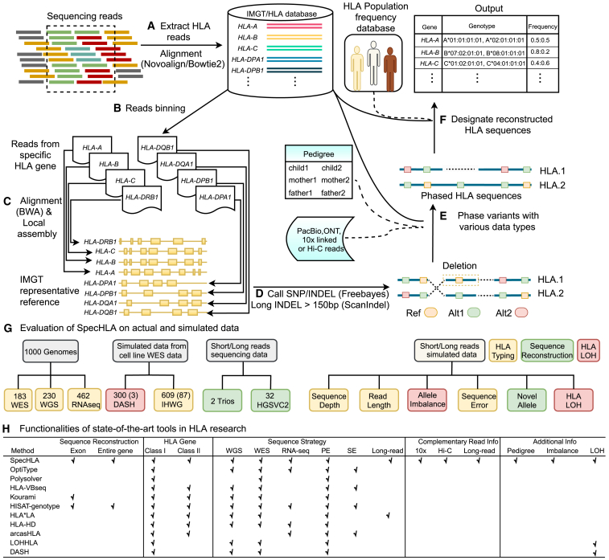
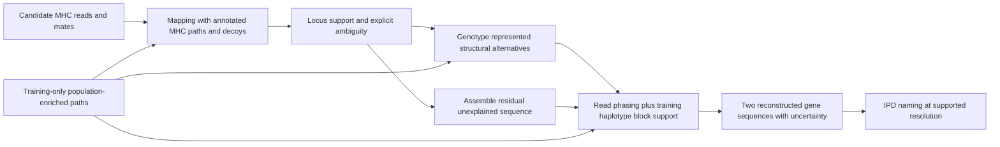

# SpecHLA + our MHC pangenome: workflow review and development proposal

Reviewed 2026-09-18. Recommendation: continue the SpecHLA route as a sequence-reconstructing HLA typer. The largest untested opportunity is the combination of graph alignment, explicit structural-allele genotyping, and haplotype-supported phase-block linking. The existing augmented-binning experiment demonstrates a useful reference-panel effect; it has not yet tested those graph operations.

## Sources and provenance

- Wang et al., 2023, *SpecHLA enables full-resolution HLA typing from sequencing data*, [paper](https://doi.org/10.1016/j.crmeth.2023.100589), [full text](https://pmc.ncbi.nlm.nih.gov/articles/PMC10545945/). Read the overview, methods, discussion, limitations, and inspected Figure 1 visually. Article XML is saved as `paper.xml`, extracted body as `paper-body.txt`, and the original figure as `figure1.jpg` (CC BY, Wang et al.).
- Inspected the current [SpecHLA repository](https://github.com/deepomicslab/SpecHLA), pinned to `c965423bb263eb4ead599d7cca8d103e616cf1c5`. Relevant scripts are saved under `upstream/`; commit metadata is in `upstream-commit.json`. Our existing runs use the separately installed 1.0.12 environment. Pin and compare these versions before importing upstream changes.
- Inspected our `../DESIGN.md`, `../REPORT.md`, `../spechla_pg.sh`, `../build_refs.py`, `../build_graph_pggb.sh`, `../designate.py`, `../score.py`, and job scripts; checked completion files and DRB1 build/mapping logs on DDBJ.
- Found Fable's original agent transcript in Claude's project history, task `a31a77b3f1142d4e5`. Its work is **this `hla-spechla-pg/` project**, with cluster root `/home/leechuck/hla/spechla-pg`. The transcript records termination on exhausted usage credits, followed by continuation work recorded in the parent conversation. The code should be reused and audited, rather than recreated or assumed complete.



## What the overview figure tells us

The central allele database connects to several distinct operations: recruitment/binning (A/B), a single representative reference for alignment (C), linking unconnected phase blocks (E), and official naming (F). Population frequencies feed designation separately. This makes a modular intervention possible.

The spectral graph used by SpecHap in E is a graph of phasing evidence. It is a different object from our graph of genomic sequences. We can retain spectral phasing while replacing its inputs and adding sequence-path support.

In the paper's reference-sensitivity experiment, one alternative DRB1 reference reduced two-field accuracy to 65.3%. Its simulation also reports much higher binning recall with Novoalign than Bowtie2 (89.4% vs 49.9%, with high precision for both). These are the paper's measurements, not predictions for our samples. They motivate testing C/D and measuring A/B independently of downstream names. Our pilot uses Bowtie2.

## Interventions mapped to A–F

| Figure step | Inspected implementation | Proposed use of our graph | What would demonstrate benefit |
|---|---|---|---|
| **A: recruit / align candidate reads** | Region extraction, then alignment against a collection of allele sequences. | Include diverse full-length paths and flanks; eventually recruit against an MHC index with competing paralogs and decoys. Retain unmapped reads and mates as candidate input where feasible. | More true gene-origin reads recovered, without increased cross-locus contamination; depth and allele-balance gains. |
| **B: assign reads to loci** | Best allele per gene; paired alignment, no clipping, default NM ≤2 per end and identity gap between genes. | Keep the existing rule as baseline. A graph-aware alternative should compare support between gene families using path/locus annotations, paired-end context and unique flanks, retaining an explicit ambiguous class. | A/B/C and DRB1/3/4/5 confusion matrix, locus-assignment precision/recall, and downstream reconstruction gains. |
| **C: alignment + local assembly** | BWA to one representative per gene; assembly/realignment in a fixed list of reference windows. | Align to alternative population haplotypes. Preserve graph alignments and insertion sequence; use discordant/clipped reads and poorly explained regions to trigger local assembly. Compare with an inexpensive adaptive linear-reference control. | Correct placement and balanced coverage across divergent DRB1 introns and other difficult regions; improvement survives variant calling and sequence reconstruction. |
| **D: small and long variants** | FreeBayes for small variants; optional ScanIndel for >150-bp indels. Our current wrapper runs the former, with long-indel discovery off. | Genotype alleles already represented by graph branches, including insertions absent from the representative. Discover residual small variants against supported local haplotype backbones; retain assembly-based discovery for novel structural sequence. | Correct structural-allele dosage and sequence recovery, including bases off the original reference. Distinguish known graph alleles from genuinely new sequence. |
| **E: phase / reconstruct** | Read-based spectral phasing, then IMGT sequences help link disconnected blocks. | Use observed, donor-labelled full-gene panel paths to score block combinations. Preserve read-supported phase; allow recombination and uncertainty when no panel path explains all blocks. | Fewer switch errors and more complete correct diploid gene sequences, at matched callable coverage. |
| **F: designation** | Reconstructed sequences matched to IPD; population frequencies help resolve naming. | Keep IPD as the nomenclature authority. Use graph paths for sequence context and exact sequence/CDS/protein/G-group resolution. Report exact matches, ambiguous matches, and nearest-known names distinctly. | Improved supported resolution and novelty detection without turning unknown sequences into unjustified exact names. |

The proposed priority is **C/D for structural sequence recovery, E for a relatively clean immediate test**, with A/B retained as a measured baseline. F should initially be held fixed so that a change in naming policy cannot masquerade as better reconstruction.

## What already works, and what remains untested

The existing native-versus-A experiment completed for eight fold-0 donors. With the native designator retained, both arms score 61/63 two-field genotypes. Adding panel sequences to the read-binning database raises exact sequence matches from 41/128 to 51/128 under the existing infix-alignment scorer. The gains in exact matches are in A/B/C; DRB1 and DQB1 remain 0/16 in both arms. In mode A, mean DRB1 edit distance remains approximately 3,155 bases.

This is evidence that adding relevant sequence helps read collection. It is a panel-augmented linear binning experiment, not evidence for graph alignment or graph variant calling.

DDBJ currently has COMPLETE markers for native, A, and binning for the eight donors, and none for AD or ADEF. The normalised fold-0 DRB1 graph finished building. The prior raw graph produced extremely slow Giraffe extensions, including 461 seconds for one read pair. A completed graph rebuild has not yet demonstrated that mapping or typing is repaired. The raw and normalised node counts alone cannot establish that either graph is more biologically appropriate or computationally tractable.

Existing components to reuse:

- `build_refs.py`: fold-specific donor/relative exclusions; expanded binning database; expanded E/F databases; per-gene graph FASTAs.
- `spechla_pg.sh`: native-compatible stages and A/AD/ADEF configurations.
- `build_graph_pggb.sh`: graph construction plus normalisation and Giraffe indexing.
- `build_exons.py`, `designate.py`: exon annotations and experimental sequence-aware naming.
- `score.py`: initial pairwise naming/sequence scoring and experimental truth comparison.

## The main limitation of the current AD design

The wrapper runs:

```
Giraffe → BAM projected onto SpecHLA reference → original local realignment
        → FreeBayes → original reference-based phasing/consensus
```

Despite the name AD, its graph substitution is principally at **C, alignment**. D remains a linear small-variant caller. The graph inputs are the training panel sequences plus the SpecHLA reference; the expanded IPD database is not automatically incorporated into those graphs.

Projection may produce useful linear alignments and should be measured as a controlled baseline. It does not by itself solve large insertion representation, novel structural variants, or phase-consistent traversal of graph alternatives. Even after successful graph mapping, the downstream fixed reference, local-assembly windows, and DRB1 repeat handling can remain the bottleneck. Keep graph-native alignments alongside projected BAM and measure what representation is retained or lost.

[VG's mapping documentation](https://github.com/vgteam/vg/wiki/Mapping-short-reads-with-Giraffe) distinguishes graph alignments from reference-projected output. [Its genotyping documentation](https://github.com/vgteam/vg/wiki/SV-Genotyping-and-variant-calling) provides `vg pack`/`vg call` for represented graph variation, but explicitly cautions that its de novo augmentation recipe does not discover SVs. Therefore **“replace FreeBayes with vg call” is not a complete novel-allele reconstruction method**.

A practical development route is hybrid:

1. Retain graph alignments to identify supported structural paths/alleles and candidate haplotype backbones.
2. Call residual sequence changes with read evidence and local assembly, allowing departures from panel haplotypes.
3. Combine structural and small-variant evidence into two gene sequences with explicit phasing and uncertainty.
4. Name those sequences using unchanged IPD rules first; test improved designation separately.

## Changes our graph and annotations need

**Preserve true locus context.** Start from the existing MHC sequence resource, retaining complete genes, flanks, donor/haplotype provenance and gene/paralog identity. Separate per-gene graphs are useful for calling after reliable binning. Cross-gene recruitment needs competition between paralogs and pseudogenes, preferably with shared MHC/DR context. Adding DRB3/4/5 to a decoy database is not equivalent to typing their copy number. Joint structural DRB typing is a later extension beyond SpecHLA's eight diploid loci.

**Add IPD diversity without inventing complete haplotypes.** Add appropriate missing full-genomic IPD alleles as annotated paths. Represent partial exon/CDS-only alleles as partial evidence or explicitly synthetic candidates; attaching an exon to a panel intron is a hypothesis, not an observed full-length allele. Preserve rare and non-Asian alternatives as fallback paths. The graph can be population-enriched without enforcing a population-specific whitelist.

**Use path-specific annotations and coordinate translation.** Store exon/CDS boundaries, gene extent, orientation and repeat/duplication intervals for each path. Retain mappings to SpecHLA and GRCh38 coordinates. Upstream `select.region.txt`, variant interval filters, block-linker gene lengths and DRB1 repeat logic encode fixed coordinates. Swapping the reference or its flanks requires updating these consumers coherently. A graph-normalisation step must preserve every retained biological path sequence and recoverable annotation.

**Control complexity without deleting biology.** Verify sequence spellings before and after normalisation, index consistency, branch coverage and read mapping on difficult regions. Collapse redundant identical sequence with an alias/provenance table; preserve distinct structural copies and haplotype multiplicity in metadata. Sample-supported path selection can reduce mapping complexity, but needs a fallback for rare paths. Builder choice remains empirical: the earlier PGGB-versus-Minigraph-Cactus comparison was unfinished, so the existing report's categorical builder preference is not established.

**Treat population information as a soft, evaluated prior.** The cohort mix is selected and includes multiple assembly sources. Raw path counts do not estimate population allele frequencies. Deduplicate donor/haplotype observations, separate ancestry strata where justified, and evaluate uniform versus smoothed panel priors without excluding rare/novel alleles. Test ancestry contribution with size-matched panels. Our current `frequency_prior()` pools labelled training paths; it is not a calibrated population-frequency model.

**Exclude evaluation material before graph construction.** The production whole-MHC graph includes development donors. For evaluation, removing their named paths after construction can leave test-derived sequence/topology behind. Rebuild training-only locus graphs and all downstream databases/priors, including family and duplicate-assembly exclusions. Identical sequences supplied independently by other training donors can legitimately remain.

## Specific audit items before restarting experiments

1. **Do not trust a COMPLETE file alone.** `jobs/run_donor.sbatch` catches native failures and still touches COMPLETE. Require all expected nonempty outputs, exit status and a configuration manifest. The scorer currently can include partial directories in sequence scoring. Predeclare eligible donor/gene sets and count failures explicitly.
2. **Make reference version a separate factor.** A currently retains the native lite database and appends panel sequence; E/F uses IPD 3.65 plus panel. Compare IPD-only versus IPD+panel at the same version, with identical annotation/masking settings. The paper specifies lite release 3.37; our earlier design calls it 3.38. Pin sequence checksums and actual installed metadata instead of inferring release from a different naming file.
3. **Separate E from the blocked AD arm.** Add an AE experiment: reuse mode-A reads/alignment/variants, change only block-linking reference. Current ADEF couples several interventions, and waits on graph mapping unnecessarily. Score both native and experimental designation on the same reconstruction.
4. **Cache by configuration.** Binning is reused from one per-donor `bin/COMPLETE`; graph builds are skipped if some output files exist. Include input/database hashes, graph normalisation version, exclusions, software and parameters in cache keys. Distinguish raw and normalised graph runs in output paths.
5. **Check ambiguity after enlarging the index.** Bowtie2 returns at most 30 alignments in the current wrapper. Many similar panel paths may change which genes are represented among those hits. Measure assignment stability across candidate limits and sequence deduplication; a recall increase alone can conceal contamination.
6. **Fix naming semantics before treating F as a result.** `label_for()` picks the first name among exact CDS matches, which cannot always justify intronic/four-field resolution. The nearest-labelled fallback should be reported as nearest, not an exact novel-allele designation. Length-based filtering can reject genuine short alleles. Evaluate global/anchored gene comparison and exon-aware ambiguity handling, rather than relying on an arbitrary label or unrestricted infix distances.
7. **Correct E's scoring before testing a larger database.** In both the installed and current upstream `Linkage` class, `high_score` is initialised from the first common BLAST subject and subsequent larger scores are not selected. I isolated the class and supplied the same two candidates in opposite orders: the result was 18,000 versus 20,000; both should have returned 20,000. See `block-linker-order-check.json` and `installed-map_block2_database.py`. This proves order dependence in that scoring routine, not its quantitative impact on our donors. Fix and test it, then use both the unmodified native baseline and a corrected native baseline in E comparisons, so an algorithmic repair is distinguished from a pangenome contribution.
8. **Improve sequence evaluation.** Existing 41→51 counts require the truth gene body to match a substring of the reconstruction. This tolerates extra flanking sequence by design, but does not measure excess sequence or all structural errors. Report annotated gene-boundary global identity, sequence precision/recall, exact CDS, callable fraction, masking, large-indel accuracy and switch errors alongside the legacy measure. Compare both haplotypes with the same optimal pairing and keep denominators fixed.

## Proposed experiment order

**First, a small diagnostic gate.** Use DRB1 on HG00706/HG02155/HG03804 and a class-I control such as HLA-A. These are development cases for debugging, not an accuracy claim. Verify normalised graph path preservation, mapping termination, balanced haplotype coverage, and off-reference sequence support. Compare projected BAM before/after original realignment. Use retained artifacts to distinguish mapping, calling, phasing and designation errors.

**Then, isolate the most reusable changes across all eight pilot donors:**

| Arm | Read collection | C/D | E | Main question |
|---|---|---|---|---|
| Native pinned baseline | IPD | Native, small variants | Native | Reproduce baseline |
| Matched database control | Same-release IPD only | Native | Native | How much is database freshness? |
| A | IPD + panel sequences | Native | Native | Reproduce observed binning gain |
| AE | As A | As A | Same-release IPD + panel paths | Does better linkage improve reconstruction? |
| A + normalised graph alignment (existing AD) | As A | Giraffe projection + original caller | Native | Does graph-assisted mapping survive the linear pipeline? |
| A + adaptive linear reference | As A | Read-selected training reference(s), transformed annotations | Native | Is a closer reference sufficient? |
| A + structural graph genotyping / residual assembly | As A | Hybrid representation-aware inference | Native, then expanded in a separate arm | Does retaining structural alternatives recover complete genes? |

A native long-indel-enabled run is also an essential control on the structural cases, since the current baseline and wrapper have that option off. Keep F-native initially; compare F alternatives post hoc on identical sequences. Follow successful pilot arms with the other 32 development donors. Freeze the method before the locked 228/946 validation; do not tune on those test sets.

A useful success criterion is more accurate **complete reconstructed genes and coding sequences**, with preserved classical-name accuracy, acceptable runtime, and fewer unexplained/no-call bases. Include graph-absent alleles and rare haplotypes so the method is evaluated as a reconstruction method rather than only a panel lookup.

## Proposed architecture



This is a development proposal grounded in the paper, source and existing pilot. No new typing jobs were submitted and no production graph or pipeline was changed during this review.
